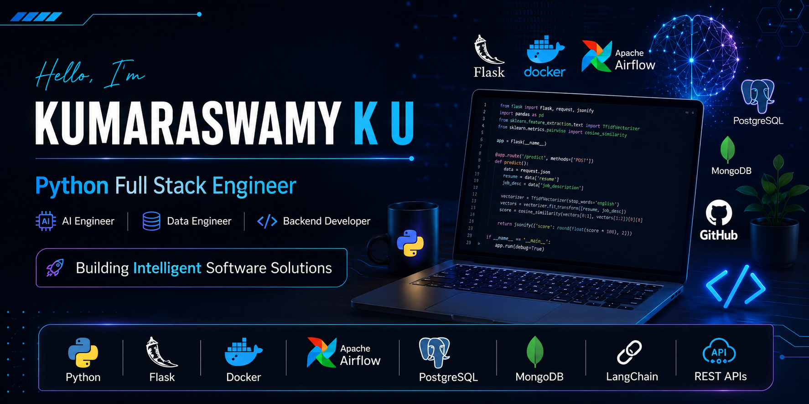

  

<h1 align="center">Hi 👋 I'm Kumaraswamy K U</h1>

<h3 align="center">
🚀 Python Full Stack Engineer | AI/ML Engineer | Data Analyst
</h3>

🎓 Final Year Computer Science Engineering Student (2027 Graduate)

💡 Passionate about Backend Development, Artificial Intelligence, Data Analytics and Modern Software Development.

---

# 👨‍💻 About Me

- 🎓 Final Year Computer Science Engineering Student
- 🐍 Python Full Stack Developer
- 🤖 AI & Machine Learning Enthusiast
- 📊 Data Analytics Enthusiast
- ⚙️ Backend Developer using Flask & REST APIs
- 🗄️ MySQL • MongoDB
- 📦 Docker & GitHub Actions Learner
- 📈 Skilled in SQL, Power BI & Data Visualization
- 🧩 Solving DSA Problems on LeetCode
- 🚀 Love building real-world software projects

---

# 🛠 Tech Stack

## 📊 Data Analytics

- SQL
- MySQL
- Power BI
- Apache Airflow
- ETL Pipelines
- Pandas
- NumPy
- Plotly
- Matplotlib
- MS Excel

---

## 🤖 Artificial Intelligence & Machine Learning

- Scikit-Learn
- NLP
- TF-IDF
- LangChain
- Ollama
- RAG
- PySpark

---

# 💼 Experience

## 🤖 Artificial Intelligence Intern

### 1Stop.ai

- Built Machine Learning models using Python
- Worked with Scikit-Learn
- Data Preprocessing
- Feature Engineering
- Model Evaluation

---

## 📊 Data Analytics Intern

### iStudio Technologies

- Data Analysis using Python
- SQL Querying
- Power BI Dashboard Development
- Data Cleaning & Visualization
- Automated Business Reporting

---

# 🚀 Featured Projects

## 🔹 AI Resume Screening System

✅ Python

✅ Flask

✅ NLP

✅ TF-IDF

✅ Machine Learning

---

## 🔹 Apache Airflow ETL Pipeline

✅ Python

✅ Apache Airflow

✅ Docker

✅ MySQL

---

## 🔹 Offline RAG Assistant

✅ LangChain

✅ Ollama

✅ Docker

✅ ChromaDB

---

# 🔥 GitHub Streak

---

# 📈 Contribution Graph

---

# 💻 LeetCode

---

# 🌐 Connect With Me

---

# 💡 Interests

- Python Development
- Full Stack Development
- Artificial Intelligence
- Data Analytics
- Backend Development
- Machine Learning

---

### ⭐ Thanks for visiting my GitHub Profile!

### 💻 Building scalable software solutions with Python, AI & Data Analytics.

### ⭐ If you like my work, consider giving a star to my repositories.

